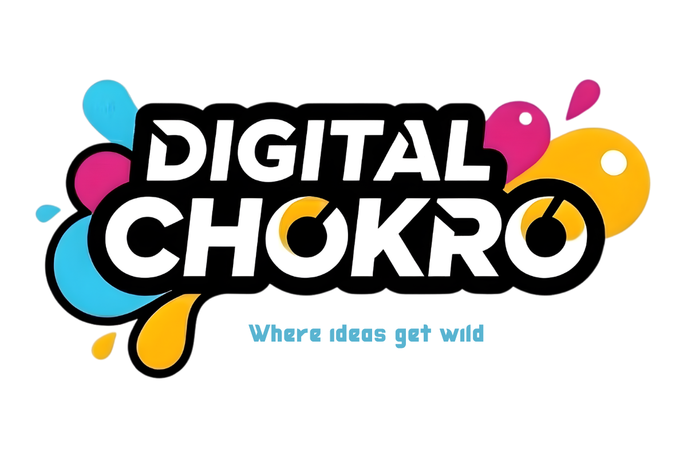

  
  <h1>Hi, I'm Nur Mohammad 👋</h1>
  
<b>Founder & Lead Engineer at <a href="https://digitalchokro.com">Digital Chokro</a></b>

---

### 🚀 About Me
I'm a Software Engineer based in Bangladesh, specializing in **Flutter, Laravel, React, and AI Integration**. I focus on building multi-tenant SaaS products and reliable cross-platform applications.

At **Digital Chokro**, I lead an engineering team dedicated to turning complex business requirements into clean, practical software solutions.

### 🛠 Tech Stack
- **Mobile Development:** Flutter, Dart, Riverpod, SQLite (Offline-First)
- **Frontend Web:** React (Vite), Vue 3, Inertia.js, TailwindCSS
- **Backend & APIs:** Laravel 11 (PHP 8.2), Node.js (Express)
- **Database & Architecture:** PostgreSQL, MySQL, Firebase, Supabase, Monorepos
- **AI & Emerging Tech:** Google Gemini API, Ollama (Local LLMs), RAG pipelines (`sqlite-vec`)

---

### 🔥 Flagship Projects

| Project | Description | Stack |
|---------|-------------|-------|
| 📦 **[Business Chokro](https://github.com/imnurmohammad-me/business-chokro)** | A multi-tenant POS and Business OS. Includes an offline-capable POS queue, live inventory tracking, and biometric employee check-in. | `Flutter`, `Riverpod`, `Node.js`, `PostgreSQL` |
| 🌐 **[Digital Chokro Agency](https://github.com/imnurmohammad-me/digital-chokro-agency)** | The internal CRM and client portal for our software agency, complete with role-based access control and clear client dashboards. | `Laravel 11`, `Filament v3`, `Vue 3`, `Inertia.js` |
| 🧠 **[Diro AI](https://github.com/imnurmohammad-me/diro)** | A private, fully local AI assistant workspace built on Ollama, using `sqlite-vec` for Retrieval-Augmented Generation (RAG). | `React 19`, `Ollama`, `Node.js` |
| 🧾 **[Ishan CRM](https://github.com/imnurmohammad-me/ishan-crm)** | A lightweight, offline-capable Vanilla JS invoice and client management SPA for small retail shops. | `Vanilla JS`, `Supabase Realtime` |
| 🛒 **[Insaf Inventory](https://github.com/imnurmohammad-me/insaf-inventory)** | A cross-platform POS application with secure cloud syncing, designed for small-to-medium retail stores. | `Flutter`, `Firebase` |

---

### 🌐 Let's Connect
- 🏢 **Agency:** [digitalchokro.com](https://digitalchokro.com)
- 💼 **LinkedIn:** [nur-mohammad](https://linkedin.com/in/imnurmohammad)

 

  

