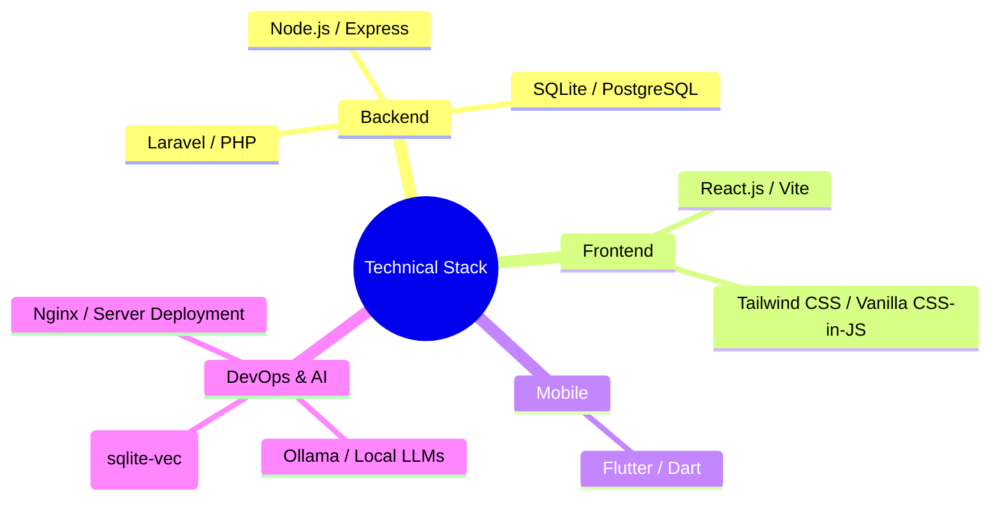
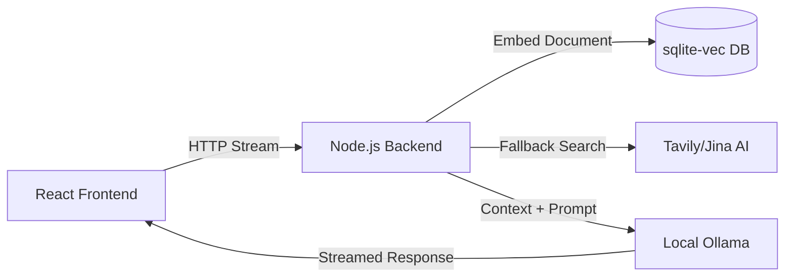

# Nur Mohammad
**Full-Stack Developer | System Architect | AI Integration Specialist**

Welcome to my GitHub profile. I am a software engineer specializing in scalable full-stack development, cross-platform mobile applications, and local AI implementations. I architect systems that blend robust backend logic with highly polished frontend experiences.

---

## Technical Expertise

## Core Competencies

- **Full-Stack Development:** Extensive experience building end-to-end solutions using React and Laravel (e.g., Inventory Systems, CRM applications).
- **Local AI & RAG Systems:** Architecting privacy-first AI interfaces powered by local LLMs (Ollama) with Retrieval-Augmented Generation capabilities.
- **Cross-Platform Mobile:** Developing performant mobile applications using Flutter for Android and iOS.
- **Agency Engineering:** Engineering foundational architectures and products for Digital Chokro.

## Featured Architecture: AI Chat System

Below is a high-level representation of the RAG (Retrieval-Augmented Generation) AI architecture I implement in my advanced projects.

## Professional Philosophy
I believe in writing clean, decoupled code that prioritizes user privacy and system longevity. My current focus is bridging the gap between powerful local AI models and seamless consumer-facing interfaces.

---
*Generated and structured for maximum clarity and professionalism.*
